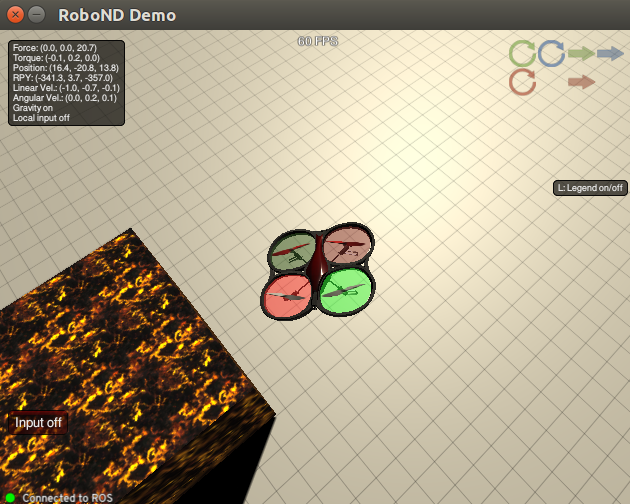
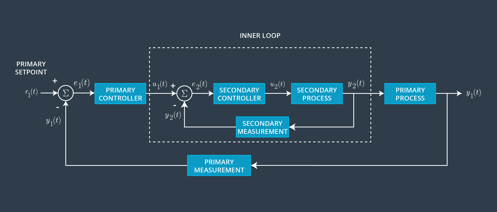

# Quadrotor Controller Project #

[](https://www.udacity.com/robotics)

Jun Zhu



---

## Setup Environment

```sh
$ cd [your/system/path]/catkin_ws/
$ catkin_make
$ rosdep install --from-paths src --ignore-src --rosdistro=kinetic -y
$ catkin_make
$ source devel/setup.bash
```

## Launch the simulator

**Run `roscore` first, then the simulator**!!!

## Tune the PID parameters



### Hover controller

```sh
$ roslaunch quad_controller hover_controller.launch
```
or

```sh
$ rosrun quad_controller setup_2d_hover_world.sh
$ rosrun quad_controller hover_controller_node.py
$ rosrun rqt_reconfigure rqt_reconfigure
```

**Why does the quad overshoot more frequently when heading to a set point at a lower altitude? **


### Attitude controller

```sh
$ roslaunch quad_controller attitude_controller.launch
```
or

```sh
$ rosrun quad_controller setup_attitude_world.sh
$ rosrun quad_controller attitude_controller_node.py
$ rosrun rqt_reconfigure rqt_reconfigure
```

### Position and attitude controller

Main loop: position

Inner loop: pitch and roll

```sh
$ roslaunch quad_controller position_controller.launch
```
or

```sh
$ rosrun quad_controller attitude_controller_node.py
$ rosrun quad_controller position_controller_node.py
$ rosrun rqt_reconfigure rqt_reconfigure
```


